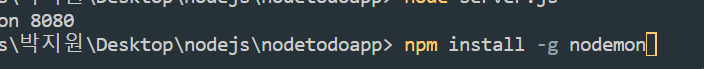

### 서버란 ?

요청을하면 요청한 내용을 보내주는 프로그램

# 요청 4가지방식

#### 읽기 GET

#### 쓰기 POST

#### 수정 PUT

#### 삭제 DELETE

---

---

# Node.js 란?

## javascript

html에 종속되는 언어, 웹페이지를 좀더 다이나믹하게 만들어 주기 위해 만들어졌음.

## 브라우저마다 자바스크립트 해석엔진을 가지고 있다

크롬은 v8 익스플로러는 chakra 파이어폭스는 spidermonkey

노드 js는 크롬의 자바스크립트해석엔진 v8에서 따왔다. 브라우저말고도 다른환경에서도 자바스크립트를 실행할 수 있게 도와준다.

## 노드 js로 서버를 만드는 이유 ?

코드가 매우 짧고 쉽다 (빠른 개발 가능,피벗 잘됨)

Non-blocking I/O 이라는 장점이있다

## Non-blocking I/O

요청부터 다 받고 처리가 빠른 순서대로 처리한다.

sns,채팅서비스 (특징: 요청이 매우많음) <br/> -요청이 많거나 오래걸리는 요청이 있어도 대기시간 x

# Express

터미널 > npm init > entry 에 server.js (파일명) 만 잘입력하면됨 > npm install express

### yarn

설치가 안된다면 yarn 사이트에서 다운로드후 yarn install express 명령어로 다운로드 할 수 있다.

# get요청하기

```
const express = require("express");
const app = express();

app.listen(8080, function () {
  console.log("listening on 8080");
});
//첫번째 파라미터는 포트번호, 두번째 파라미터는 띄운후실행할코드

/*
누군가가 /pet으로 방문을 하면 ..
pet관련된 안내문을 띄워주자 */

app.get("/pet", function (요청, 응답) {
  응답.send("펫용품 쇼핑할 수 있는 페이지입니다.");
});

app.get("/beauty", function (req, res) {
  res.send("뷰티용품을 쇼핑할 수 있는 페이지입니다람쥐");
});
```

# nodemon 사용한 자동화



## npm install -g nodemon

-g 는 이파일 뿐만아니라 파일전역에서 쓰겠다는 소리임

yarn add global nodemon

## nodemon 파일명.js

오류나면 파워쉘에서
executionpolicy
set-executionpolicy unrestricted 입력

# POST

```
      <form action="/add" method="post">
```

```
app.post("/add", (req, res) => {
  res.send("전송완료");
});

```

터미널에

### npm install body-parser

그리고 다시 노드를 연결한다

```
const bodyParser = require("body-parser");
app.use(bodyParser.urlencoded({ extended: true }));


app.post("/add", (req, res) => {
  res.send("전송완료");
  console.log(req.body.title);
  console.log(req.body.date);
});
```

```
        <div class="form-group">
          <label>오늘의 할일</label>
          <input type="text" class="form-control" name="title" />
        </div>
        <div class="form-group">
          <label>날짜</label>
          <input type="text" class="form-control" name="date" />
        </div>
```

# REST API

api? 웹서버와 고객간의 소통방법

## 1. uniform interface

하나의 자료는 하나의 url로

## 2.Client-Server 역할구분

브라우저는 요청만할뿐
서버는 응답만 할뿐

## 3.Stateless

요청1과요청2는 의존성이 없어야함

## 4.Cacheable

서버에서 보내주는 정보들은 캐싱이 가능해야함(크롬이 알아서해줌)

## 5.Layered System

## 6.Code on Demand

# URL 이름짓기 관습

단어보다는 명사위주

언더바\_ 보다는 대시- 사용

하위문서를 뜻할땐 / 기호사용하기
