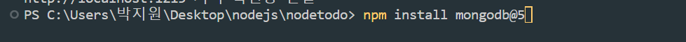

```
const { MongoClient } = require('mongodb')

let db
const url = 'mongodb사이트에 있던 님들의 DB 접속 URL'
new MongoClient(url).connect().then((client)=>{
  console.log('DB연결성공')
  db = client.db('db이름넣기')
  <!-- 서버띄우느코드 -->
}).catch((err)=>{
  console.log(err)
})
```
